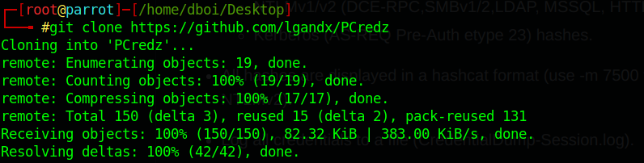
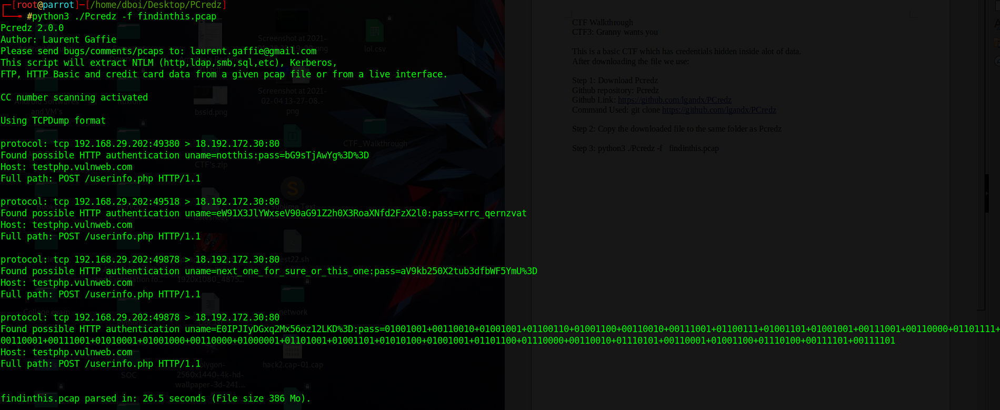
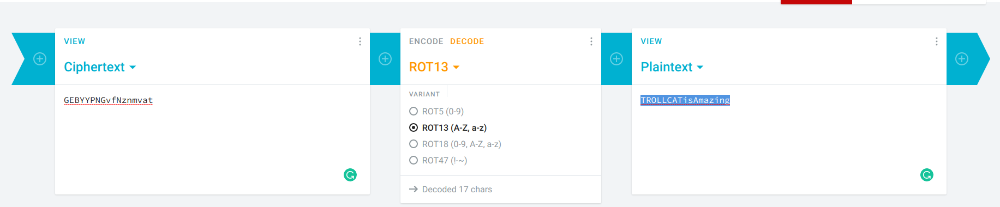
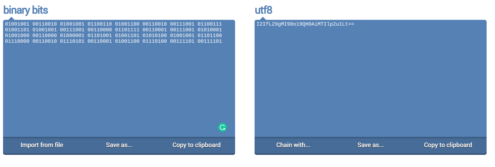

# Trollcat-CTF-Network-Walkthroughs
These are the walkthroughs of all the Network Based CTF's created by dboidembla (Amritya)

CTF1: Free Wi-fi

CTF 1 is just a simple bruteforce based CTF, For this you need a wordlist (Prefferably rockyou.txt) 

Steps of Solving:
1. Initialting Brute Force
	Tool Used: aircrack-ng
	Command Used: aircrack-ng hack1-01.cap -w /usr/share/wordlists/rockyou.txt 
Output:
	
  

  
CTF2: I am so sed

CTF 2 is just a simple bruteforce based CTF, For this you need a wordlist (Prefferably rockyou.txt). But before that we need to make some edits to rockyou.txt

Steps of Solving:
1. Changing Rockyou.txt
	Command Used: sed 's/^/TROLLCAT{/;s/$/}/' rockyou.txt > notrock.txt
	The New Dictionary Looks Like:
	
Output:

2. Initialting Brute Force
	Tool Used: aircrack-ng
	Command Used: aircrack-ng hack2.cap-01.cap -w /home/dboi/Desktop/wordlist/notrock.txt 

Output:

CTF3: Granny wants you

This is a basic CTF which has credentials hidden inside alot of data.
After downloading the file we do:

Step 1: Download Pcredz
Github repository: Pcredz
Github Link: https://github.com/lgandx/PCredz
Command Used: git clone https://github.com/lgandx/PCredz

Step 2: Copy the downloaded file to the same folder as Pcredz

Step 3: python3 ./Pcredz -f   findinthis.pcap

Step 4: You will find a few Credentials which you might need to decipher and most of them will be trolling
So after all these trolling Credentials we find 
uname = E0IPJIyDGxq2Mx56oz12LKD%3D
so converting %3D i.e. %3D is “=”
So, uname = E0IPJIyDGxq2Mx56oz12LKD=
So we now deocde this
First through ROT 13 Decoder
we get : R0VCWVlQTkd2Zk56bm12YXQ=
Now through base64 decoding: GEBYYPNGvfNznmvat
Again through rot13 decode
So our final uname is: TROLLCATisAmazing

Step 5: Deciphering Password
First we convert binary to utf-8, after this we decipher it using rot13 and then we decode it via base64
so password becomes: Welcome_to_CSCodershub

Flag = uname:password
i.e. = TROLLCATisAmazing:Welcome_to_CSCodershub

