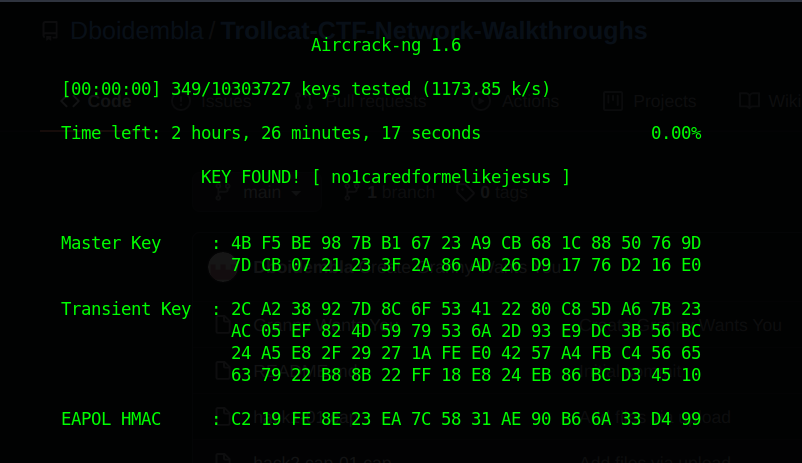

# Trollcat-CTF-Network-Walkthroughs
These are the walkthroughs of all the Network Based CTF's created by dboidembla (Amritya)

CTF1: Free Wi-fi

CTF 1 is just a simple bruteforce based CTF, For this you need a wordlist (Prefferably rockyou.txt) 

Steps of Solving:
1. Initialting Brute Force
	Tool Used: aircrack-ng
	Command Used: aircrack-ng hack1-01.cap -w /usr/share/wordlists/rockyou.txt 
Output:
	
  

  
CTF2: I am so sed

CTF 2 is just a simple bruteforce based CTF, For this you need a wordlist (Prefferably rockyou.txt). But before that we need to make some edits to rockyou.txt

Steps of Solving:
1. Changing Rockyou.txt
	Command Used: sed 's/^/TROLLCAT{/;s/$/}/' rockyou.txt > notrock.txt
	The New Dictionary Looks Like:
	
Output:

2. Initialting Brute Force
	Tool Used: aircrack-ng
	Command Used: aircrack-ng hack2.cap-01.cap -w /home/dboi/Desktop/wordlist/notrock.txt 

Output:

